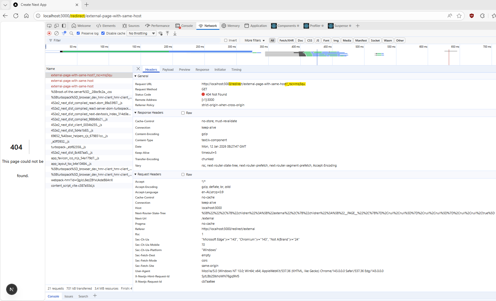
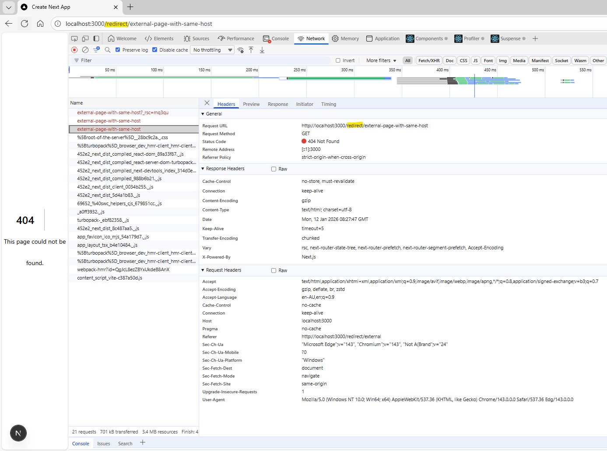

# Overview

This is a [Next.js](https://nextjs.org) project bootstrapped with [`create-next-app`](https://nextjs.org/docs/app/api-reference/cli/create-next-app) created to reproduce redirect error to external URL with same host from a server action.

It is expected that the redirect will take the user to the expected absolute URL that is provided, but it redirects and appends the `basePath` to the pathname which makes it seem like it is treating URL as an internal redirect.

**Steps to Reproduce:**

1. Run on port 3000
2. Navigate to `http://localhost:3000/redirect/external`
3. Expected: Redirected to 404 error page with URL `http://localhost:3000/external-page-with-same-host`
4. Actual: Redirected to 404 error page with URL `http://localhost:3000/redirect/external-page-with-same-host`

NOTES:
- This will only occur the first time the page is loaded, after that the redirect works as expected

